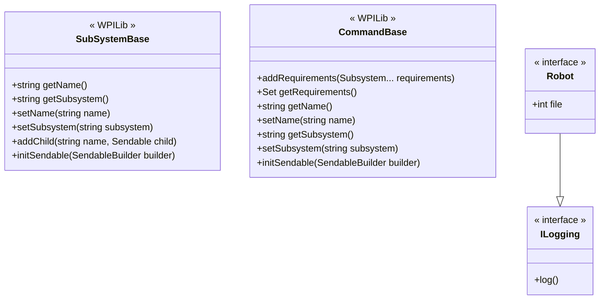

# Robotics System Design

# Logging

```mermaid
classDiagram

class SubSystemBase {
    << WPILib >>
    << abstract >>
    +string getName()
    +string getSubsystem()
    +setName(string name)
    +setSubsystem(string subsystem)
    +addChild(string name, Sendable child)
    +initSendable(SendableBuilder builder)
}

class CommandBase {
    << WPILib >>
    << abstract >>

    +addRequirements(Subsystem... requirements)
    +Set<Subsystem> getRequirements()
    +string getName()
    +setName(string name)
    +string getSubsystem()
    +setSubsystem(string subsystem)
    +initSendable(SendableBuilder builder) 

}


class ILogging {
<< interface >>
   +log() 
}

class Robot  {
<< interface >>
+int file    
}

Robot --|> ILogging

```
