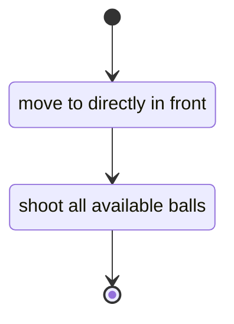
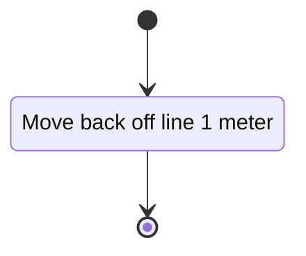
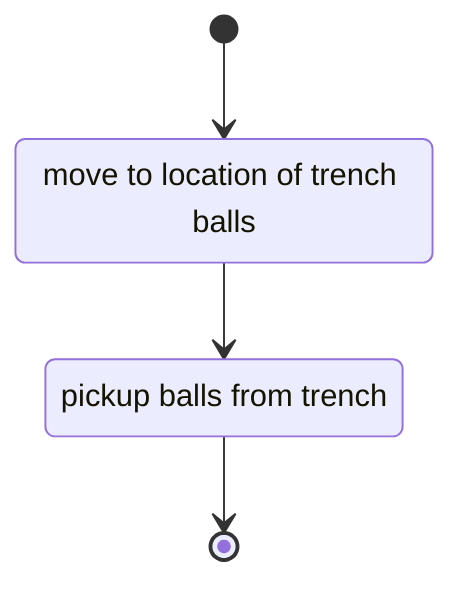
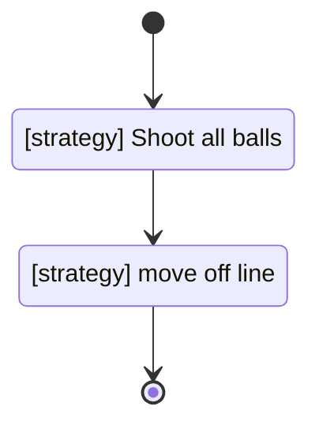
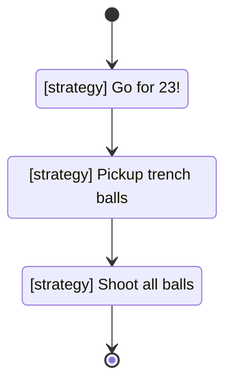

# Strategies

## Shoot all balls

```mermaid
stateDiagram

start:move to directly in front
shoot: shoot all available balls

[*]-->start
start-->shoot
shoot-->[*]
```

## Move off line

```mermaid
stateDiagram
moveBackward: Move back off line 1 meter

[*]-->moveBackward
moveBackward-->[*]
```
## Pickup trench balls

```mermaid
stateDiagram

moveToTrenchBalls: move to location of trench balls
pickupTrenchBalls: pickup balls from trench

[*]-->moveToTrenchBalls
moveToTrenchBalls-->pickupTrenchBalls
pickupTrenchBalls-->[*]
```

## Go for 23!

```mermaid
stateDiagram

startStrategy: [strategy] Shoot all balls
moveBackwards: [strategy] move off line

[*]-->startStrategy
startStrategy-->moveBackwards
moveBackwards-->[*]
```

## Go for 23 + 18 = 41pts!

```mermaid
stateDiagram

startStrategy: [strategy] Go for 23!
pickupTrenchBalls: [strategy] Pickup trench balls
shootStrategy: [strategy] Shoot all balls

[*]-->startStrategy
startStrategy-->pickupTrenchBalls
pickupTrenchBalls-->shootStrategy
shootStrategy-->[*]
```