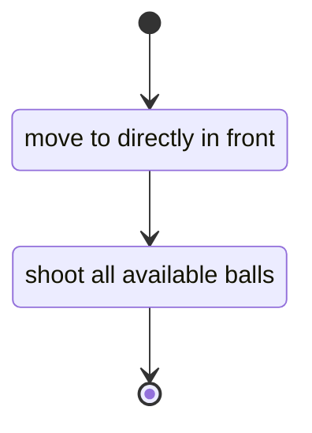
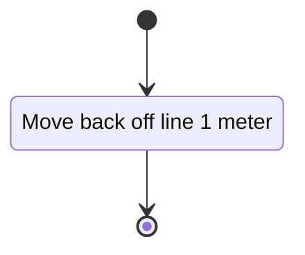
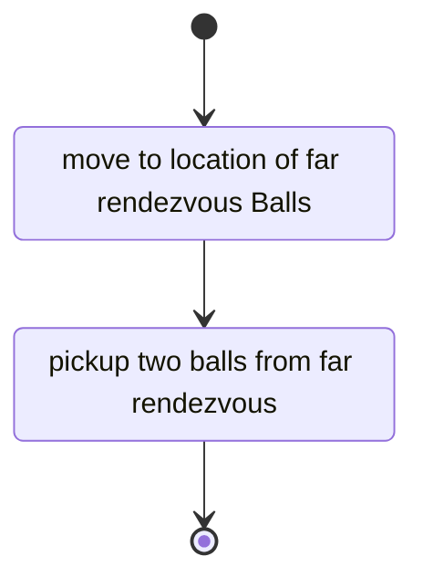
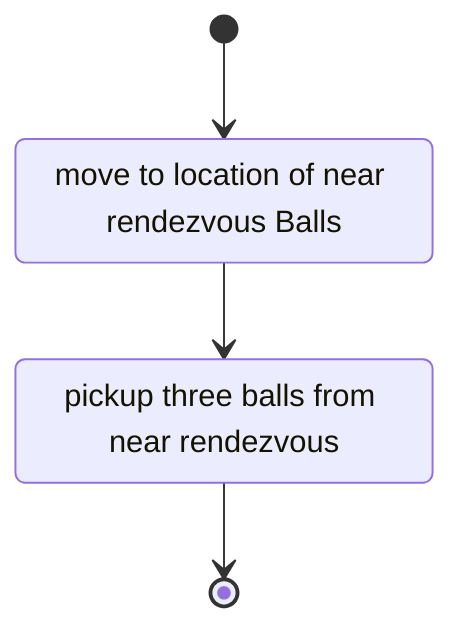
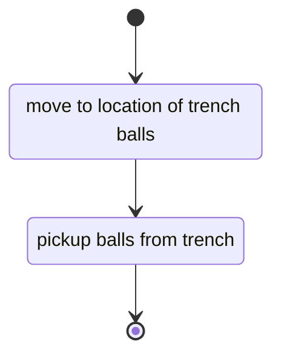
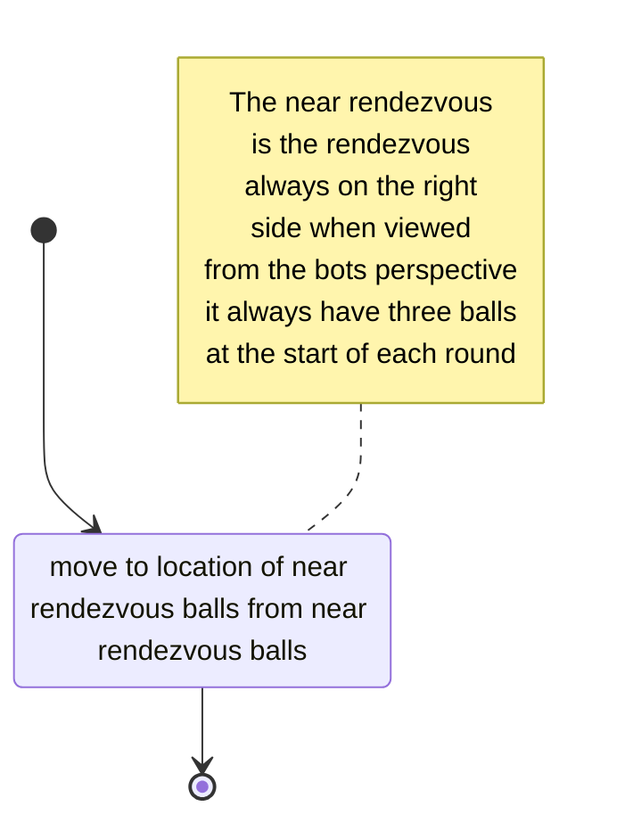
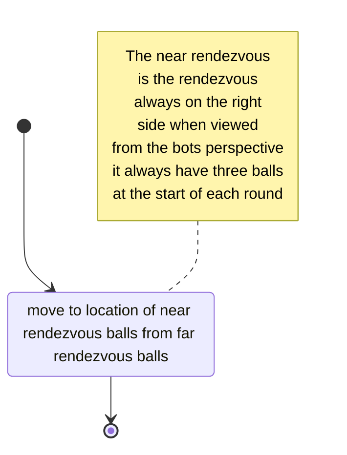
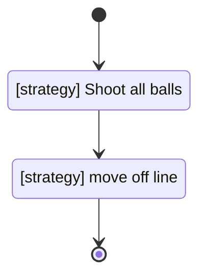
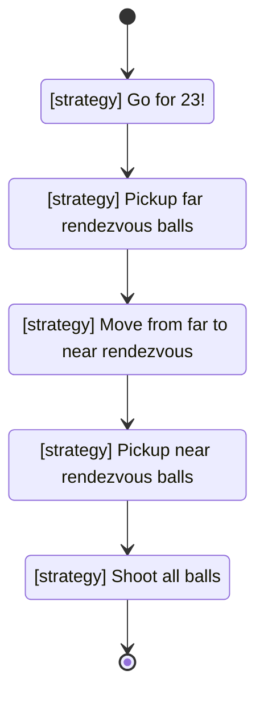
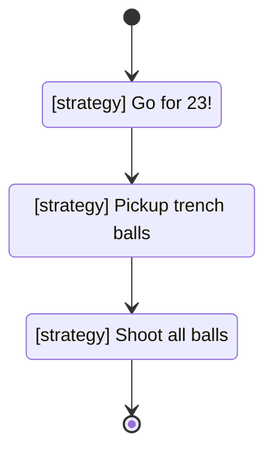

# Strategies

## Shoot all balls

## Move off line

## Pickup far rendezvous balls

## Pickup near rendezvous balls

## Pickup trench balls

## Near to far rendezvous transition

## Far to near rendezvous transition

## Go for 23!

## Go for 23 + 30 = 53pts!

## Go for 23 + 18 = 41pts!

